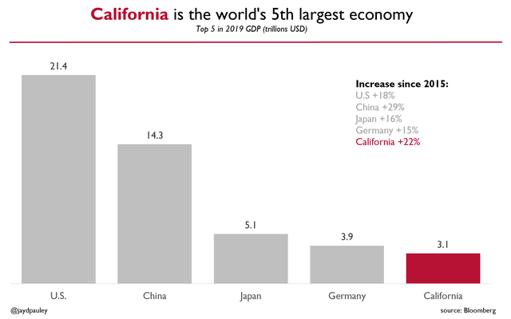

```{r setup, include=FALSE}
knitr::opts_chunk$set(echo = TRUE)
```

## Graphics Lies, Misleading Visuals
### Applied plotting, Charting & Data Representation in Python,
Week1 - Assignment 1

This is the First assignment of the Second Course of Specialiazation of applied Data Science in Python on Coursera.

Read Alberto Cairo’s work, Graphics Lies, Misleading Visuals

Locate an example of a misleading visual that uses one or more of the mechanisms for misleading that Cairo outlines in his book chapter: (1) Hiding relevant data; (2) Displaying too much data and obscuring reality; (3) Distorting data through visual forms.

Please upload an image of this visual using a widely accessible graphic format (e.g., PDF, .jpg, .png)

```{r imagen, echo=FALSE, fig.cap="A caption", out.width = '100%'}

```

Misleading Example

Briefly describe the context for the visual by addressing the following questions:

1.What is the source of the visual? (e.g., URL or bibliographic citation)

##### Answer1: 
Citation:subreddits dataisbeautiful
 https://www.reddit.com/r/dataisbeautiful/comments/o0dyts/oc_california_is_the_worlds_5th_largest_economy/

2.Who is the intended audience (i.e., decoders)? How do you know this?

##### Answer 2: 
Intended audience to be owned  economists, investors, businessmen, entrepreneurs. Based on my own consulting experience businessmen t is most likely to come from a businessmen). The intended audience are possibly from clients of that businessmen.

##### Descriptions of the assignment part2:

* 1.Identify the specific component(s) of the visual that is/are misleading

##### Answer: 
This chart contains all the three misleading characteristics, hiding relevant data, displaying too much data and obscuring reality and distorting data through visual forms.

* 2.For each part(s) of the visualization that is/are misleading, identify the mechanism that is used: hiding relevant data to highlight what benefits us; displaying too much data to obscure reality; using graphic forms in inappropriate ways (distorting the data)

##### Answer: 
For the 1st part of the misleading visualization, had hiden the relevant data of years , it is hiding data from all states of the USA but showing data from California  time intervals. Combined by the 2nd part of the misleading visualization, the author had chosen too much useless data to obscure the views demonstrated by his real wishes. After all,had used graphic forms in inapproriate ways to distort the data and highlighting California that does not represent the entire country (USA).

3.Explain how the mechanisms are used to mislead

##### Answer: 
To start with, had only represented the data with the top 5 GPD 2019 without any comparison to other time intervals of the study and it is only showing data from California and not from the entire United States. Combined by the 2nd part of the misleading visualization,had chosen too much useless data to obscure the views demonstrated by his real wishes. After all,had used graphic forms in inapproriate ways to distort the data, highlighting California that does not represent the entire country (USA).Finally,  had distorted data to only show data for California and all cities in the United States.


### Optional: Describe any additional issues you found with visual that did not fall under Cairo’s three misleading mechanisms.

 My conclusion is that the logic error is another mechanism of the misleadings.
